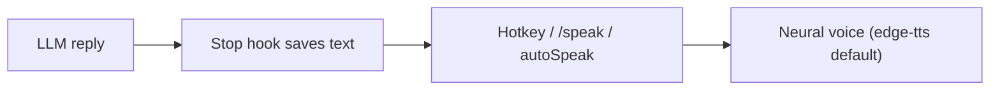

<div align="center">

# 🔊 OutLoud

### OutLoud — give your AI coding agent a voice (Claude Code, Grok Build; Gemini/Codex next).

A lightweight, on-demand (and optional auto-narration) text-to-speech speaker plugin. High-quality neural voice via **edge-tts + playsound** (no media-player popup), with native/`pyttsx3` fallbacks. **Zero extra LLM tokens** — it only speaks text that was already generated.

[](LICENSE)
[](https://github.com/rhishi99/OutLoud/actions/workflows/test.yml)
[](https://docs.claude.com/en/docs/claude-code)
[](https://grok.com)
[](#-contributing)
[](#-requirements)
[](https://rhishi99.github.io/OutLoud)

</div>

---

> **Rebrand note**: This project was previously known as `claude-code-voice` and the **GitHub repo is now [`rhishi99/OutLoud`](https://github.com/rhishi99/OutLoud)** (the old URL auto-redirects).  
> Config/state directories remain `claude-code-voice` internally (`%APPDATA%\claude-code-voice`, `~/.config/claude-code-voice`) so existing setups keep working — only the repo name changed.

---

## TL;DR

**The problem** — long AI replies are walls of text that tire eyes and kill flow.

**OutLoud's fix** — zero extra tokens, instant voice narration.



---

## 🎬 Demo

> **Placeholder ready** — real 20-40s recording of `/speak last` + `/speak on` (with terminal + actual audio) coming soon.

**Drop-in instructions for the real demo asset:**

```bash
# Recommended: use OBS Studio / Windows Game Bar / ffmpeg
# Example (macOS):
#   ffmpeg -f avfoundation -i "1:0" -t 35 assets/demo.mp4
# Then embed below and commit:
#   <video src="assets/demo.mp4" controls width="100%"></video>
```

<!-- Replace this block with the real asset when ready -->
```text
[ assets/demo.mp4  —  terminal capture + voice of /speak last and /speak on  ]
```

See it in action in the [interactive visualizer](https://rhishi99.github.io/OutLoud/voice-plugin-visualizer.html) too.

---

## 🚀 Built with Grok Build

This project was **designed and built end-to-end with [Grok Build](https://grok.com)** — full credit to Grok for the architecture, the iterative build loop, the multi-agent docs sweep, and the live tooling. The entire build journey (every milestone, every fix) is captured in an interactive timeline:

- 📈 **[build-journey.html](https://rhishi99.github.io/OutLoud/build-journey.html)** — the Grok Build story, milestone by milestone (live, rendered)
- 🎛️ **[voice-plugin-visualizer.html](https://rhishi99.github.io/OutLoud/voice-plugin-visualizer.html)** — live architecture + interactive config console

> Open either file in a browser to see how it came together.

> **Credits & roles**: **OutLoud was fully designed and built by [Grok Build](https://grok.com)** — all architecture, code, engines, hooks, and the build journey. **Claude Code** only performed **cosmetic doc edits, repo validation, and the final publish/push** (repo creation, link rename to `OutLoud`, WSL quickstart wording). No core functionality was authored by Claude.

---

## ✨ Features

- 🎙️ **Natural neural voice** — `edge-tts` (Microsoft `en-US-AriaNeural` by default) for genuinely human-sounding output.
- 🔇 **No popup** — `playsound` plays the MP3 directly. No media player hijacking your screen.
- 💸 **Zero extra tokens** — the speaker reads text Claude/Grok *already* produced. It never calls an LLM.
- ⌨️ **Multiple triggers** — hotkey, `/speak` slash command, CLI, or status-line badge.
- 🪝 **Automatic capture** — a Stop hook quietly saves the last response so it's ready to speak on demand.
- 🔁 **Optional autoSpeak** — opt-in automatic narration after Stop (with limits, code skipping, and modes).
- 🧩 **Real plugin** — proper hooks, commands, and skills.
- 🤖 **Multi-agent** — one shared backend powers both **Claude Code** (hook-based) and **Grok Build** (direct invoke).
- 🔁 **Pluggable engines** — `edge-tts`, `native` (OS built-in, offline, zero deps), `pyttsx3`. `kokoro` (offline neural) is paused/experimental.
- ♿ **Accessibility-first** — listen while you work; great for eyes-off and screen-reader-adjacent workflows.
- 🔇 **Global mute** — `OUTLOUD_MUTE=1` kill switch (respected everywhere).

---

## 📦 Quick Start

### Option A — Install as a Claude Code plugin

```bash
/plugin marketplace add rhishi99/OutLoud
/plugin install speaker@outloud
```

After install, use `/speak` (it may appear as `/speaker:speak` in the menu).

Recommended first step:
```
/speaker:setup
```

This dedicated command forces validation + prints the exact minimal setup instructions for your platform (or "✅ setup completed" if everything is ready).

**WSL/Linux/mac users**: run `/speaker:setup` — it will give you the precise `sudo apt` + `pip` lines to copy-paste.

### Option B — Clone & set up locally (incl. WSL)

```bash
git clone https://github.com/rhishi99/OutLoud.git
cd OutLoud

python3 -m venv .venv
source .venv/bin/activate          # Windows: .venv\Scripts\activate
pip install -r requirements.txt

python scripts/speaker.py --set engine edge-tts --set voice "en-US-AriaNeural"
```

### Add the status line badge (recommended)

See the dedicated **[Status Line](#status-line-informational-only)** section below.

---

## ▶️ First run / WSL setup (now mostly automatic)

After `/plugin install speaker@outloud`, just type:

```
/speak last
```

or

```
/speaker:config
```

**Run `/speaker:setup`** — it will detect issues and print the exact minimal commands (or confirm ✅ setup completed).

### Quick manual version (if you prefer)

**WSL/Linux/mac (one time in your terminal):**
```bash
sudo apt update && sudo apt install -y python3-pip python3-venv mpg123
pip install --user edge-tts playsound==1.2.2
```

Then use `/speak` again. The plugin now drives most of this for you on first use. 

**Audio in WSL**: WSLg (Windows 11+) gives audio for free. Without it, run the speaker from native Windows instead.

### `/speak` commands

| Command | Effect |
|---|---|
| `/speak last` | speak the last response on demand |
| `/speak "text"` | speak arbitrary text immediately |
| `/speak on` | enable autoSpeak (auto-narrate after Stop hook) |
| `/speak off` | disable auto-narration |
| `/speak stop` | best-effort stop current playback |

> Tip: `/speak` with **no argument** is ambiguous (the agent will ask what you want). Use `/speak last` or `/speak on` to act directly.

The default engine is **edge-tts** (natural neural voice). `OUTLOUD_MUTE=1` is a global kill switch honored everywhere. If a response wasn't captured yet, capture happens on the **next** Stop — ask something first, then `/speak last`.

---

## 🐧 Minimal WSL path (plugin does most of the work)

Preferred flow:
1. `/plugin marketplace add rhishi99/OutLoud`
2. `/plugin install speaker@outloud`
3. Inside Claude Code type `/speak last`

The plugin will print the exact 2 lines you need to run in your WSL terminal (apt + pip).

Only if you want to clone manually for development, see the older detailed steps in previous versions of this README or the repo history.

**Audio note**: WSLg (Windows 11) is the easiest. Otherwise run the speaker commands from a Windows PowerShell instead of inside WSL.

---

## Status Line (informational only)

OutLoud can show a compact badge in Claude Code's footer / status bar:

- `OutLoud` (on-demand ready)
- `auto` (autoSpeak enabled)
- `OutLoud [muted]` (when `OUTLOUD_MUTE=1`)
- `/speak` (fallback label)

**Honest note**: The status line is **text-only** and **NOT clickable**. It is purely informational.  
There is no button or tap target — use your global hotkey or type `/speak` (or `/speak last`) in the prompt.

### How to install the status line

1. Add (or merge) the following into `~/.claude/settings.json` (create the file if it does not exist):

```json
{
  "statusLine": {
    "command": "node \"/absolute/path/to/claude-code-voice/scripts/status.js\""
  }
}
```

**Use an absolute path** to `scripts/status.js` (example for Windows):

```json
"command": "node \"C:\\Users\\YourName\\path\\to\\claude-code-voice\\scripts\\status.js\""
```

2. Fully restart Claude Code.

The script reads your live `config.json` + the `OUTLOUD_MUTE` env var on every render.

---

## 🎧 Usage

1. Ask Claude (or Grok) something.
2. Hear the last response any of these ways:
   - Press your hotkey (e.g. `Ctrl+Alt+S`)
   - Type `/speak` (or `/speak last`)
   - Run it directly:
     ```bash
     python scripts/speaker.py --last
     ```
3. Speak arbitrary text:
   ```bash
   python scripts/speaker.py "This is a very natural voice"
   /speak Some custom text here
   ```
4. Toggle auto-narration:
   ```bash
   /speak on          # enable autoSpeak
   /speak off         # disable autoSpeak
   /speak stop        # best-effort stop current playback
   ```

> Large code blocks are spoken as `[code block]` (or omitted entirely under autoSpeak) so you're not read a wall of syntax.

---

## 🗣️ AutoSpeak (optional automatic narration)

`autoSpeak` lets OutLoud automatically read responses aloud after the Stop hook (opt-in only). It is **disabled by default**.

It always runs **non-blocking** (detached process) and never holds the hook.

### The four config keys

| Key                        | Type    | Default   | Description |
|----------------------------|---------|-----------|-------------|
| `autoSpeak`                | boolean | `false`   | Master switch. When `true`, the Stop hook will speak a processed slice of the response. |
| `autoSpeakMaxChars`        | number  | `1200`    | Hard cap on characters spoken automatically (shorter & friendlier than the on-demand `max_chars`). |
| `autoSpeakSkipCodeBlocks`  | boolean | `true`    | When `true`, fenced + inline code is stripped entirely (clean narration). When `false`, code becomes `[code block]`. |
| `autoSpeakMode`            | string  | `"full"`  | How to truncate when over the char limit:<br>• `"full"` — take the first N chars (word-aware)<br>• `"summary"` — first sentence + last sentence<br>• `"first-paragraph"` — up to first blank line (or cutoff) |

### Examples

Enable a nice summary mode (recommended for long answers):

```json
{
  "autoSpeak": true,
  "autoSpeakMaxChars": 900,
  "autoSpeakSkipCodeBlocks": true,
  "autoSpeakMode": "summary"
}
```

Minimal "first paragraph only":

```bash
python scripts/speaker.py --set autoSpeak true
python scripts/speaker.py --set autoSpeakMaxChars 600
python scripts/speaker.py --set autoSpeakMode first-paragraph
```

Via slash command (Claude Code):

```
/speak on
/speak off
```

Via the CLI (works everywhere):

```bash
python scripts/speaker.py --autospeak on
python scripts/speaker.py --autospeak off
python scripts/speaker.py --config
```

**Safety**: `autoSpeak` is completely ignored when `OUTLOUD_MUTE=1` is set.

On-demand hotkey + `/speak` (and `/speak last`) **always** use the full saved last response (subject only to the regular `max_chars` + `strip_code` settings).

---

## 🔧 Configuration

All settings live in a single JSON file:

- **Windows**: `%APPDATA%\claude-code-voice\config.json`
- **macOS / Linux**: `~/.config/claude-code-voice/config.json`

See [`config.example.json`](config.example.json) for a complete starting point.

### Full config reference

| Key                        | Type    | Default            | Notes |
|----------------------------|---------|--------------------|-------|
| `engine`                   | string  | `"edge-tts"`       | `edge-tts` (recommended), `native`, `pyttsx3`, `kokoro` (experimental) |
| `voice`                    | string  | `"en-US-AriaNeural"` | Engine-specific voice name/ID |
| `rate`                     | number  | `1.0`              | 0.5–2.0 speed multiplier |
| `volume`                   | number  | `1.0`              | 0.0–1.0 |
| `language`                 | string  | `"en"`             | Used by some engines (e.g. kokoro) |
| `strip_code`               | boolean | `true`             | On-demand: replace code blocks with `[code block]` |
| `max_chars`                | number  | `6500`             | Hard truncation for on-demand speech |
| `autoSpeak`                | boolean | `false`            | Enable automatic narration after Stop |
| `autoSpeakMaxChars`        | number  | `1200`             | Char limit for auto narration |
| `autoSpeakSkipCodeBlocks`  | boolean | `true`             | Strip code when auto-speaking |
| `autoSpeakMode`            | string  | `"full"`           | `"full"` \| `"summary"` \| `"first-paragraph"` |

**Global kill switch** (environment variable, works everywhere):

```bash
OUTLOUD_MUTE=1
```

When set, **all** speech (manual + autoSpeak) is suppressed. Perfect for CI, pair programming, or recording.

Change settings live:

```bash
python scripts/speaker.py --set engine edge-tts
python scripts/speaker.py --set voice en-GB-SoniaNeural
python scripts/speaker.py --set rate 1.05
python scripts/speaker.py --config
python scripts/speaker.py --list-voices
```

---

## 🗣️ Engines

| Engine | Quality | Install | Offline | Best for |
|--------|---------|---------|---------|----------|
| **edge-tts** *(default)* | Excellent | `pip install edge-tts playsound==1.2.2` | No | Natural listening |
| native | Basic (fast) | None (built-in) | Yes | Zero dependencies |
| pyttsx3 | Good | `pip install pyttsx3` | Yes | Better native control |
| kokoro *(paused/experimental)* | Very good (local neural) | contributions welcome | Yes | Fully offline neural |

Change engine/voice anytime (see Configuration section above).

---

## 🖥️ Platform & Engine Matrix

| Platform   | edge-tts                  | native                     | pyttsx3                    | kokoro (exp.)         |
|------------|---------------------------|----------------------------|----------------------------|-----------------------|
| **Windows** | ✅ full (needs net)      | ✅ full, offline           | ✅ full, offline           | ⚠️ heavy, optional    |
| **macOS**   | ✅ full (needs net)      | ✅ full, offline (`say`)   | ✅ full, offline           | ⚠️ heavy, optional    |
| **Linux**   | ✅ full (needs net)      | ⚠️ needs espeak-ng/spd-say | ✅ full, offline           | ⚠️ heavy, optional    |
| **WSL**     | ✅ (WSLg/PulseAudio + net) | ⚠️ see WSL audio section  | ⚠️ audio often limited     | ⚠️ heavy, optional    |

> ✅ = recommended / works with audio device & deps<br>
> ⚠️ = works with extra setup or limited quality<br>
> All playback is local after synthesis (edge-tts only step needing internet).

---


## 🔧 Requirements

Minimal:

```
edge-tts
playsound==1.2.2
```

- All playback is **local** after install. `edge-tts` needs internet to synthesize.
- The `native` engine works fully offline with **zero extra packages**.
- Config + last-response live under the `claude-code-voice` directory (see above).

---

## ⌨️ Hotkeys (per-OS setup)

Bind a global hotkey so you can hear the last response from anywhere without touching the mouse or terminal.

**The exact command** to run against the saved last response:

```bash
python /full/path/to/claude-code-voice/scripts/speaker.py --last
```

**Equivalent convenient wrappers** (recommended on Windows):

- Windows: `powershell -ExecutionPolicy Bypass -File "C:\full\path\claude-code-voice\speak.ps1" -Last`
- Linux/macOS helper: `./speak.sh --last` (or `bash speak.sh --last`)

Always prefer **absolute paths** in hotkey bindings.

### Windows

**PowerToys Keyboard Manager** (easiest, zero code):

1. Open PowerToys → Keyboard Manager → Remap a shortcut.
2. New shortcut: `Ctrl + Alt + S` (or your preference).
3. Action: "Launch program".
4. Program: full path to `python.exe`
5. Arguments: `"C:\path\to\claude-code-voice\scripts\speaker.py" --last`
6. (Optional) Start in: the project folder.

**AutoHotkey v2** example (`outloud.ahk`):

```ahk
#Requires AutoHotkey v2.0
; Ctrl+Alt+S
^!s::{
    Run 'python "E:\path\to\claude-code-voice\scripts\speaker.py" --last', , "Hide"
}
```

Run the script (or compile to `.exe` and put in Startup folder).

Alternative: use the root dispatcher for native routing:

```ahk
^!s::{
    Run 'powershell -ExecutionPolicy Bypass -File "E:\path\to\claude-code-voice\speak.ps1" -Last', , "Hide"
}
```

### macOS

**Shortcuts app (built-in)**:

1. Open Shortcuts → File → New Shortcut.
2. Add action "Run Shell Script".
3. Paste:
   ```
   python3 /Users/you/path/to/claude-code-voice/scripts/speaker.py --last
   ```
4. Give it a name (e.g. "OutLoud Speak Last").
5. System Settings → Keyboard → Keyboard Shortcuts → App Shortcuts (or Services) → assign `Cmd + Shift + S`.

**Karabiner-Elements** (advanced):

Create a complex modification that runs the shell command above.

### Linux

**sxhkd** (popular with bspwm, i3, etc.) in `~/.config/sxhkd/sxhkdrc`:

```
ctrl + alt + s
    python3 /home/you/claude-code-voice/scripts/speaker.py --last
```

Then `pkill -USR1 sxhkd` (or restart).

**xbindkeys** in `~/.xbindkeysrc`:

```
"python3 /home/you/claude-code-voice/scripts/speaker.py --last"
    control + alt + s
```

Run `xbindkeys -p` to reload.

Use your window manager's native keybinding tool if preferred.

---

## 🧠 How it works

- **Claude Code:** a Stop hook (`hooks/save-last.js`) writes cleaned text to `last-response.txt` after every final response. `/speak` or your hotkey plays it.
- **Grok Build:** no Stop hook, so Grok invokes the speaker scripts directly (see [`skills/grok-voice/SKILL.md`](skills/grok-voice/SKILL.md)).
- **autoSpeak (opt-in):** when enabled, the same hook also fires a detached speaker call on a processed slice of the text.
- Both agents share the same `config.json`, engines, and capture file — one backend, two (soon more) agents.
- Speaking is always explicit (hotkey, CLI, `/speak`) **or** opt-in via `autoSpeak`. Nothing speaks by default.

See the [interactive visualizer](https://rhishi99.github.io/OutLoud/voice-plugin-visualizer.html) for the full flow diagram.

---

## ❓ Troubleshooting / FAQ

**No audio in WSL**  
WSL2 has no audio device by default. Use **WSLg** (built-in PulseAudio on Win11+). Test: `python scripts/speaker.py "hello"`.  
Fallback: run from native Windows PowerShell instead, or install `mpg123` + use edge-tts fallback players.

**edge-tts needs internet / want offline**  
`edge-tts` requires net for synthesis only. Switch instantly:  
`python scripts/speaker.py --engine native "offline test"`  
(native is zero-dep, built-in on Win/mac, needs espeak-ng on Linux).

**playsound / package issues**  
Run `/speaker:setup` — it will print the exact `pip` (and apt for WSL) commands needed.  
`pip install playsound==1.2.2` (exact pin recommended). Speaker falls back automatically if needed.  
Still stuck? Ask Claude Code to **"just set up OutLoud for me"** — `/speaker:setup` will delegate the install to a cheap sub-agent (haiku) that runs the platform-specific commands and re-validates automatically.

**Stop hook not firing / no last response**  
- Make sure the plugin is installed in Claude Code: `/plugin install speaker@outloud` (after marketplace add).  
- Check hooks: the `hooks/hooks.json` registers on Stop. Restart Claude Code after install.  
- Use `/speak last` or hotkey; first message must complete fully.

**Status line not showing**  
Add absolute path to `~/.claude/settings.json` (see Status Line section).  
**Restart Claude Code completely** (not just reload). The badge reads live config + `OUTLOUD_MUTE`.

**OUTLOUD_MUTE stuck / everything silent**  
`OUTLOUD_MUTE=1` is a hard global kill switch (respected by CLI, hooks, and autoSpeak).  
Unset it (close terminal or `set OUTLOUD_MUTE=`) or explicitly use a shell without the var. Check with `python scripts/speaker.py --config`.

**General debug**  
```bash
python scripts/speaker.py --config
python scripts/speaker.py --engine native "quick test"
OUTLOUD_MUTE=1 python scripts/speaker.py --last   # safe
```

---

## 🤝 Contributing

PRs and issues welcome — especially:

- Reviving **kokoro** for fully-offline neural voice.
- A native speaker **button** inside the Grok Build / Claude Code UI.
- More voices, engines, and platform testing (macOS / Linux / WSL).
- Polish on the upcoming folder rename.

Fork, branch, and open a PR. Keep it lightweight.

---

## 📜 License

[MIT](LICENSE) © OutLoud contributors. **Built with Grok Build.**

<div align="center">

`claude-code` · `outloud` · `tts` · `edge-tts` · `voice` · `accessibility` · `grok` · `developer-tools` · `cli` · `neural-voice`

</div>
